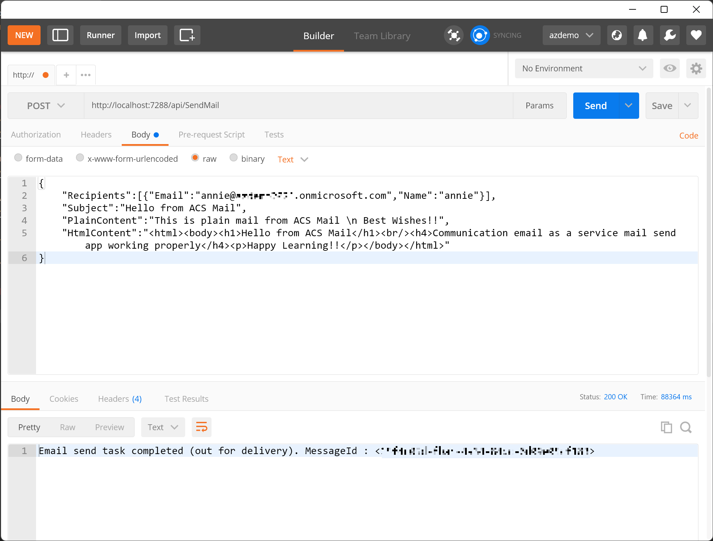
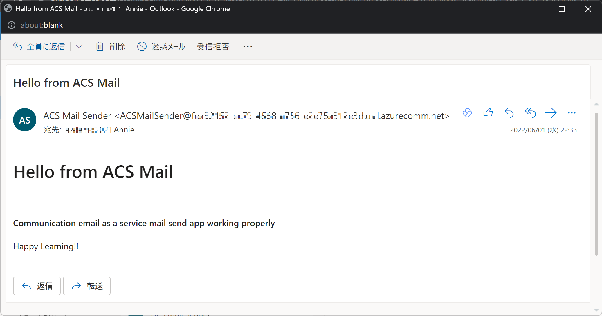
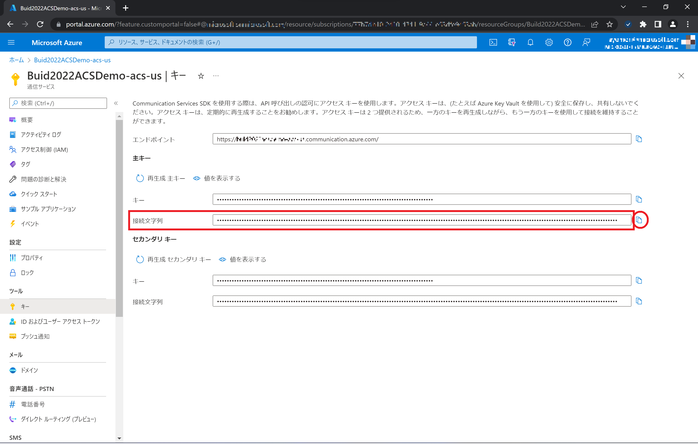
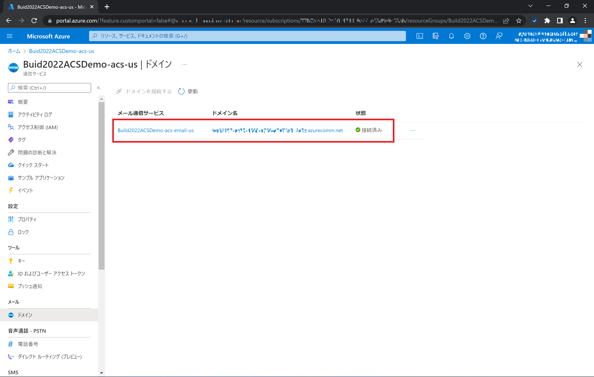
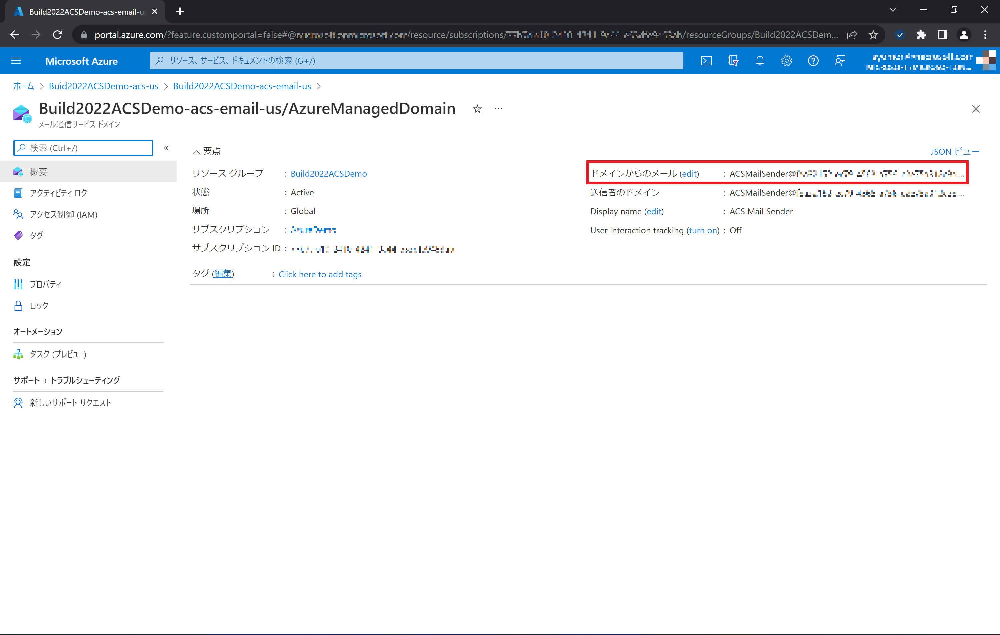

# Azure Communication Services - Email Service Samples

Code Samples using Azure Communication Services (ACS), Azure Email Communicaiton Services (ACS Mail)

# ACSSendMailFunc (Azure Function: C#)

Send email from ACS Mail by HTTP Trigger.
Set your ACS connection string and ACS email address in source code.
Send POST request to function URL, with JSON body;

```
{
	"Recipients":[{"Email":"RECIPIENTS@EXAMPLE.COM","Name":"RECIPIENTS_NAME"}],
	"Subject":"Hello from ACS Mail",
	"PlainContent":"This is plain mail from ACS Mail \n Best Wishes!!",
	"HtmlContent":"<html><body><h1>Hello from ACS Mail</h1><br/><h4>Communication email as a service mail send app working properly</h4><p>Happy Learning!!</p></body></html>"
}
```




# Prerequisites

Create ACS and ACS Mail instances on Azue Portal. (Be sure to select same data location when create).
Save your ACS connection string locally shown as below;


Provision domain (using Azure subdomain) on your ACS Mail, and connect to your ACS.


Change your ACS email sender name and email alias as desired (click *(edit)* to edit), and save your ACS email address locally shown as below;


